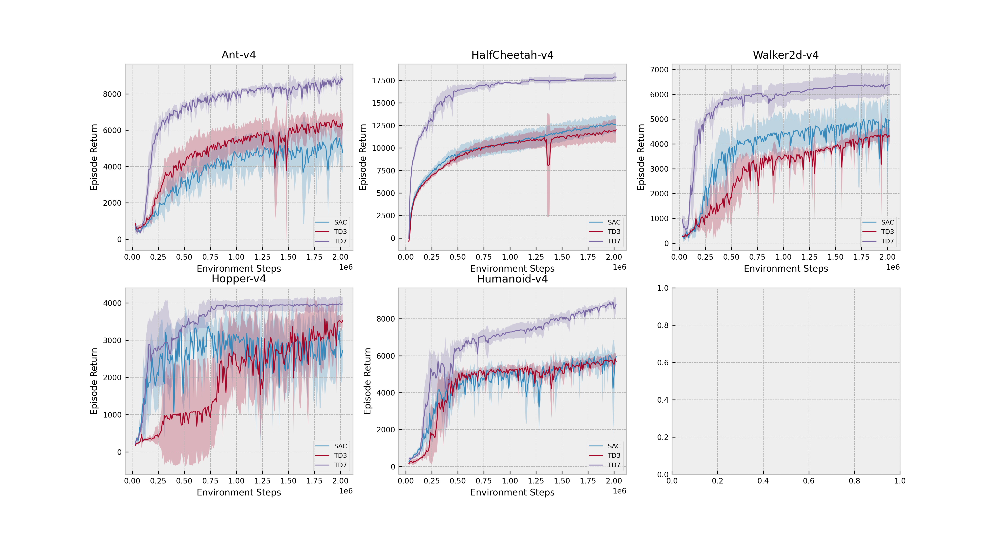

[](https://www.python.org/downloads/release/python-380/)
[](https://github.com/psf/black)
[](https://pycqa.github.io/isort/)

# A collection of off-policy reinforcement learning algorithms with Mujoco benchmark results from 4 seeds.



Welcome to our Off-Policy Reinforcement Learning (RL) Repository, where we bring together three state-of-the-art algorithms implemented in PyTorch: Soft Actor-Critic (SAC), Twin Delayed DDPG (TD3), and the latest innovation, TD7, introduced by S. Fujimoto in 2023.

**Our repository aims to provide a clean and comprehensive implementation of these three off-policy RL algorithms. We meticulously experiment with the Mujoco benchmark across eight seeds, ensuring a thorough evaluation of each algorithm's capabilities.**

RL Algorithms:

- SAC: Soft Actor-Critic, a powerful off-policy algorithm known for its excellent sample efficiency and stable training.
- TD3: Twin Delayed DDPG, a proven performer in off-policy learning, now accompanied by the latest enhancements from TD7.
- TD7: The latest advancement introduced by S. Fujimoto, incorporating four additional "know-hows" to elevate both performance and stability.

______________________________________________________________________

## Installation

```bash
# Clone repo.
git clone https://github.com/seungju-k1m/sac-td3-td7.git

# Change Directory.
cd sac-td3-td7

# Make-up virtual environment. (python version is 3.10)
python -m venv .venv --prompt rl

# Activate virtual env.
source .venv/bin/activate

# install
pip install -r requirements.txt

```

______________________________________________________________________

## Example codes

```
# There are three ways.
# First, Use cli
make cli

>>> rl sac --help
>>> rl td3 --help
>>> rl td7 --help
>>> # TD7 Example.
>>> rl td7 Ant-v4 ant@seed111 --seed 1111 --record-video
>>> # Replay your training result.
>>> replay save/td7/<your_train_dir>
>>> # ctrl+D to exit cli mode.

# Second, run python file.
python cli.py rl td7 Ant-v4 ant@seed111 -seed 1111

# Third, reproduce all the experiments: experiments with 4 different seeds corresponding to each Mujoco Env.
source run.sh
```

______________________________________________________________________

## Experiment Results


We compared the results of our Mujoco benchmark with the paper in two aspects: performance and training stability. Performance was measured as the average value across eight different seeds, while training stability was assessed by recording the agent's intermediate performance throughout the training process for each seed and visualizing these trendsation based on seeds and performance evolution during the training process.

| Environment    | Timesteps    | TD7(Ours)                    | TD7(Paper)                   | TD3(Ours)                     | SAC (Ours)                   |
| -------------- | ------------ | ---------------------------- | ---------------------------- | ----------------------------- | ---------------------------- |
| Ant-v4         | 300k <br> 1M | 6556 ± 95 <br> 7729 ± 504    | 6171 ± 831 <br> 8509 ± 422   | 3230 ± 700 <br> 5423 ± 682    | 1953 ± 785 <br> 4623 ± 984   |
| HalfCheetah-v4 | 300k <br> 1M | 14833 ± 575 <br> 17356 ± 299 | 15031 ± 401 <br> 17434 ± 155 | 7316 ± 118 <br> 10626 ± 829   | 7847 ± 384 <br> 10469 ± 1123 |
| Hopper-v4      | 300k <br> 1M | 2858 ± 1051 <br> 3905 ± 128  | 2948 ± 464 <br> 3512 ± 315   | 733 ± 817 <br> 2337 ±  1157   | 1908 ± 1117 <br> 3149 ± 661  |
| Walker2d-v4    | 300k <br> 1M | 5016 ± 452 <br> 5938 ± 487   | 5379 ± 328 <br> 6097 ± 570   | 1541.5 ± 1040 <br> 3439 ± 225 | 2560 ± 820 <br> 4293 ± 500   |
| Humanoid-v4    | 300k <br> 1M | 4910 ± 767 <br> 7287 ± 352   | 5332 ± 714 <br> 7429 ± 153   | 2504 ± 1700 <br> 5255 ± 220   | 3199 ± 458 <br> 5044 ± 390   |

______________________________________________________________________
